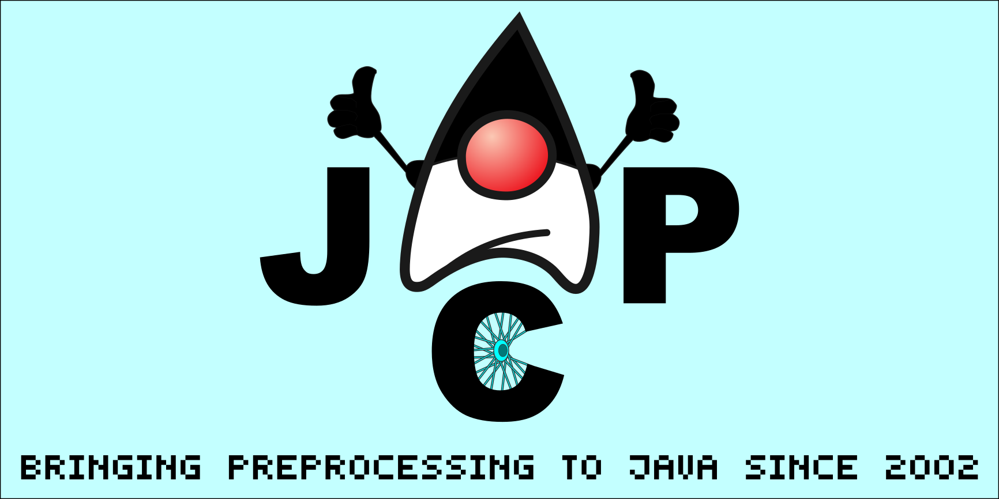

[](http://www.apache.org/licenses/LICENSE-2.0)
[](http://search.maven.org/#artifactdetails|com.igormaznitsa|jcp|7.0.5|jar)
[](http://www.oracle.com/technetwork/java/javase/downloads/index.html)
[](https://maven.apache.org/)
[](https://gradle.org/)
[](http://ant.apache.org/)
[](https://www.paypal.com/cgi-bin/webscr?cmd=_s-xclick&hosted_button_id=AHWJHJFBAWGL2)
[](https://yoomoney.ru/to/41001158080699)

# Changelog

__7.0.5 (11-dec-2021)__

- fixed compatibility with Gradle 7.x
- added support of build under JDK 16
- updated dependencies

__7.0.4 (26-sep-2020)__

- fixed default flag state `keep comments` for start in CLI
  mode [#24](https://github.com/raydac/java-comment-preprocessor/issues/24)
- fixed working directory detection in CLI mode

__7.0.3 (13-sep-2020)__

- added way to get info about all input and produced files from preprocessor context
- reworked Gradle plug-in, removed extension and now properties should be directly provided for
  task [#21](https://github.com/raydac/java-comment-preprocessor/issues/21)
- refactoring, removed some auxiliary plugins from build process and extra code

[Full changelog](https://github.com/raydac/java-comment-preprocessor/blob/master/changelog.txt)

# Introduction

Initially the tool developed for J2ME game development in 2002. It was too expensive for me to support multiple sources for many J2ME devices especially if it was needed just change position of several calls for different devices. So the preprocessor was born and because Java is the main technology in use, it is sharpened for use with C/Java family languages (which have import sections and C-comment style). For long time the preprocessor was proprietary project but since 2011 it was opened as an OSS project.

I guess, at present it is the most powerful two-pass Java preprocessor which aware for document structure (prefix, body and postfix), loops and even can use XML files as data sources ([I used to generate static web-sites with it](jcp-tests/jcp-test-static-site)). At present the preprocessor represented as a solid uber-jar including Maven, ANT and Gradle interface code and can be used with these tools as their plugin. Minimal required JDK is 1.8

__Some Linux repositories provide the preprocessor just out of the box as package `libcomment-preprocessor-java`.__

# Mind map with all options


# How to use

The Preprocessor can work as:
  - CLI tool
  - Java JAR-library
  - [Maven goal](jcp-tests/jcp-test-maven)
  - [ANT task](jcp-tests/jcp-test-ant)
  - [Gradle task](jcp-tests/jcp-test-gradle)

The preprocessor has been published in [the Maven Central](https://search.maven.org/artifact/com.igormaznitsa/jcp).
```
    <build>
        <plugins>
...
           <plugin>
                <groupId>com.igormaznitsa</groupId>
                <artifactId>jcp</artifactId>
                <version>7.0.5</version>
                <executions>
                    <execution>
                        <id>preprocessSources</id>
                        <phase>generate-sources</phase>
                        <goals>
                            <goal>preprocess</goal>
                        </goals>
                    </execution>
                </executions>
            </plugin>
...
        </plugins>
    </build>    
```

# How to use from command line
The uber-jar can be started directly under Java through CLI interface. Let's take a look at short example below how to start it in command line under Linux:
```
java -jar jcp-7.0.5.jar  --i:./test --o:./result
```
The example above just preprocessing files from ./test folder (which extensions allowed to be preprocessed by default), and placing result files into ./result folder. Keep in your mind that the preprocessor processing not all files, for instance XML files will not be preprocessed by default. Files which extension not marked for preprocessing will be just copied (of course if the extensions is not in the excluded extension list)

More complex example:
```
java -jar jcp-7.0.5.jar  --c --r --v --f:java,xml --ef:none --i:./test --o:./result  '--p:HelloWorld=$Hello world$'
```
- --c clear the destination folder before work
- --r remove all Java-style comments from preprocessed result files
- --v show verbose log about preprocessing process
- --f include .java and .xml files into preprocessing (by default the preprocessor doesn't preprocess XNL files and the extension should to be defined explicitly)
- --ef don't exclude any extension from preprocessing
- --i use ./test as source folder
- --o use ./result as destination folder
- --p define named global variable HelloWorld? with the 'Hello world' content
- --z turn on checking of file content before replacement, if the same content then preprocessor will not replace the file  
- --es allow whitespace between comment and directive (by default it is turned off)

# Some examples
- [Prepare sources for Javassist](jcp-tests/jcp-test-javassist)
- [Make multi-versioned JAR  for JEP-238](jcp-tests/jcp-test-jep238)
- [Generate static file from XML sources](jcp-tests/jcp-test-static-site)
- [Simple Android Gradle-based project](jcp-tests/jcp-test-android)

# Example of Java sources with directives
In Java the only allowed way to inject directives and to not break work of tools and compilers - is to use commented space, so that the preprocessor uses it.
```Java
//#local TESTVAR="TEST LOCAL VARIABLE"
//#echo TESTVAR=/*$TESTVAR$*/
//#include "./test/_MainProcedure.java"

public static final void testproc()
{
 System.out.println(/*$VARHELLO$*/);
 System.out.println("// Hello commentaries");
 //#local counter=10
        //#while counter!=0
        System.out.println("Number /*$counter$*/");
        //#local counter=counter-1
        //#end
 System.out.println("Current file name is /*$SRV_CUR_FILE$*/");
 System.out.println("Output dir is /*$SRV_OUT_DIR$*/");
 //#if issubstr("Hello","Hello world")
 System.out.println("Substring found");
 //#endif
}
```

# Multi-sectioned documents
In opposite a regular document, a Java document has as minimum two sections - prefix (where situated import and special information) and body. For access to such sections there are special preprocessing directives `//#prefix[-|+]`, `//#postfix[-|+]`. They allow turning on or off output into prefix and postfix sections.
```Java
//#prefix+
 import java.lang.*;
 //#prefix-
 public class Main {
  //#prefix+
  import java.util.*;
  //#prefix-
  public static void main(String ... args){}
 }
```
# How to remove all comments from sources
Sometimes it is very useful to remove totally all comments from sources, such possibility included into JCP and can be activated with either a special flag or command line switcher. The example below shows how to remove all comments with CLI use:
```
java -jar ./jcp-7.0.5.jar --i:/sourceFolder --o:/resultFolder -ef:none --r
```
